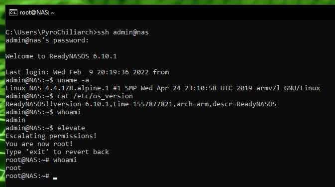

# readynas214-root

A small package that allows you to root your NETGEAR ReadyNAS.



To install, follow the below instructions
1) login to your ReadyNAS admin page through your preferred web browser
2) navigate to the Apps tab
3) Use the upload button to upload and install "elevate-armv7l.deb" from this repository
4) login through ssh as any user and type ```elevate```

To uninstall, Make sure you are running as root throught the "elevate command" then enter the below commands
1) ```export PATH=$PATH":/usr/local/sbin:/usr/sbin:/sbin"```
2) ```dpkg -r elevate-armv7l```
3) ```exit```
<br>
<br>
<br>
Tested and Works on:<br>
 - ReadyNAS 214 fw 6.10.1<br>
 - ReadyNAS 214 fw 6.10.6<br>
<br>
Will probably work on the following devices (Untested)<br>
 - ReadyNAS 102<br>
 - ReadyNAS 104<br>
 - ReadyNAS 202<br>
 - ReadyNAS 204<br>
 - ReadyNAS 212<br>
 - ReadyNAS 2120<br>
<br>

A few obligatory warnings
 - This can be a security risk if untrusted users can login with ssh
 - You can do accidental damage very easily as root
 - Don't be surprised if Netgear does not want provide support after you go messing around with root priviledges
